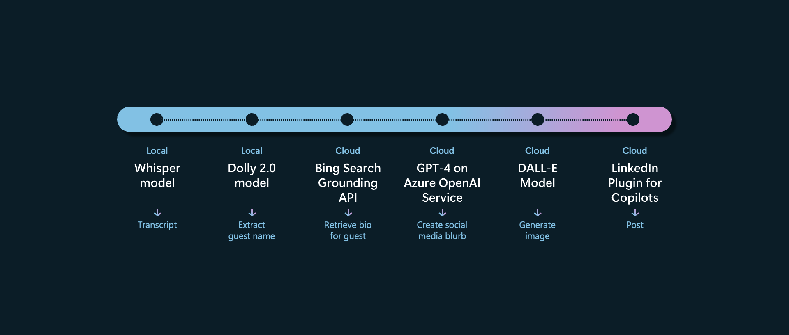

# Podcast Copilot

This code was demonstrated at the Build 2023 keynote by Microsoft CTO Kevin Scott, illustrating the architecture of a Copilot.  

Kevin Scott hosts a podcast, [Behind the Tech](https://www.microsoft.com/behind-the-tech).  This Podcast Copilot makes it easier to generate a social media post promoting a new episode of the podcast, when given the audio file for the podcast.  The Podcast Copilot uses a series of machine learning models orchestrated by LangChain to do this:
+ Given the podcast audio file, the Whisper model performs speech-to-text to generate a transcript of the podcast.  
+ Given this transcript, the Dolly 2 model extracts the name of the guest on the podcast.  
+ Given the guest name, the Bing Search Grounding API retrieves a bio for the guest from the internet.  
+ Given the transcript and guest's bio, the GPT-4 model generates a social media post promoting the podcast episode.  
+ Given the social media post, we use GPT-4 to create a relevant DALL-E prompt. 
+ Given that DALL-E prompt, the DALL-E model generates a corresponding image for the post.  
+ Finally, the user has an opportunity to review the content before posting, and if approved, a LinkedIn plugin will post the social media copy and image to LinkedIn.  



For the demo, we ran Whisper and Dolly 2 locally.  The Bing Search Grounding API is available on Azure.  We used model deployments of GPT-4, DALL-E 2, and a plugins-capable model on the Azure OpenAI service.  

Please note that as of Build (May 2023):
+ The DALL-E models are still in private preview. For the DALL-E model, you must request access using the form at https://aka.ms/oai/access and in question #22, request access to the DALL-E models for image generation.
+ The plugins-capable models are not publicly released yet.

## Setup

This project requires creating an Azure OpenAI resource to run several cloud-based models.  
+ You can request access to Azure OpenAI at https://aka.ms/oai/access.  
+ After approval, create an Azure OpenAI resource at https://portal.azure.com/#create/Microsoft.CognitiveServicesOpenAI following the instructions at https://learn.microsoft.com/azure/cognitive-services/openai/how-to/create-resource.  
+ You will need to create model deployments of the following models: gpt-4, dalle, and a plugins-capable model.  Follow the instructions [here](https://learn.microsoft.com/en-us/azure/cognitive-services/openai/how-to/create-resource#deploy-a-model).  

You will also need to create a Bing search resource at https://portal.azure.com/#create/Microsoft.BingSearch.  

Next, update the PodcastSocialMediaCopilot.py file with your settings.  
+ Update **bing_subscription_key** with the API key of your Bing resource on Azure.  
+ Update **openai_api_base** with the name of your Azure OpenAI resource; this value should look like this: "https://YOUR_AOAI_RESOURCE_NAME.openai.azure.com/"
+ Update **openai_api_key** with the corresponding API key for your Azure OpenAI resource.  
+ Update **gpt4_deployment_name** with the name of your model deployment for GPT-4 in your Azure OpenAI resource.  
+ Update **dalle_deployment_name** with the name of your model deployment for Dall-E in your Azure OpenAI resource.  
+ If your model deployments for gpt-4, dalle, and the plugins-capable model are all on the same Azure OpenAI resource, you're all set!  If not, you can override the individual endpoints and keys for the resources for the various model deployments using the variables **gpt4_endpoint**, **gpt4_api_key**, **dalle_endpoint**, **dalle_api_key**, **plugin_model_url**, and **plugin_model_api_key**.  
+ Optionally, you can also update the **podcast_url** and **podcast_audio_file** to reflect your own podcast.  

Finally, set up your environment and run the code using the following commands:
```
pip install -r requirements.txt
python PodcastSocialMediaCopilot.py
```

## Contributing

This project welcomes contributions and suggestions.  Most contributions require you to agree to a
Contributor License Agreement (CLA) declaring that you have the right to, and actually do, grant us
the rights to use your contribution. For details, visit https://cla.opensource.microsoft.com.

When you submit a pull request, a CLA bot will automatically determine whether you need to provide
a CLA and decorate the PR appropriately (e.g., status check, comment). Simply follow the instructions
provided by the bot. You will only need to do this once across all repos using our CLA.

This project has adopted the [Microsoft Open Source Code of Conduct](https://opensource.microsoft.com/codeofconduct/).
For more information see the [Code of Conduct FAQ](https://opensource.microsoft.com/codeofconduct/faq/) or
contact [opencode@microsoft.com](mailto:opencode@microsoft.com) with any additional questions or comments.

## Trademarks

This project may contain trademarks or logos for projects, products, or services. Authorized use of Microsoft 
trademarks or logos is subject to and must follow 
[Microsoft's Trademark & Brand Guidelines](https://www.microsoft.com/en-us/legal/intellectualproperty/trademarks/usage/general).
Use of Microsoft trademarks or logos in modified versions of this project must not cause confusion or imply Microsoft sponsorship.
Any use of third-party trademarks or logos are subject to those third-party's policies.
